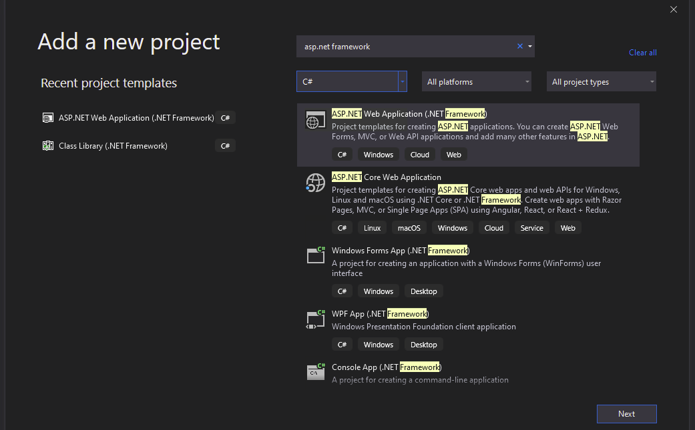
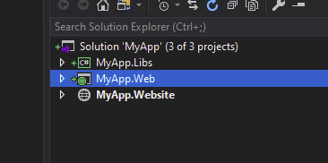
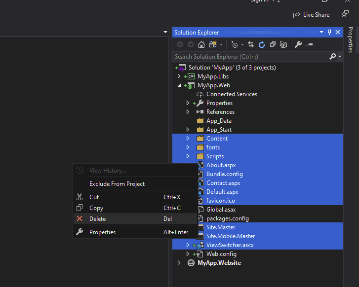
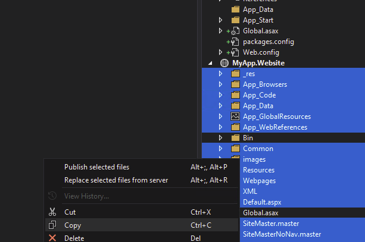
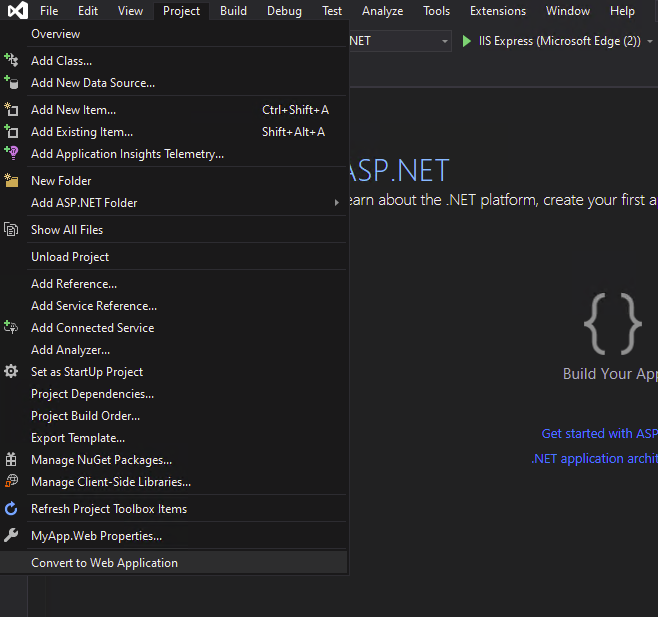

# ASP.NET Website to Web Application Migration

## Overview

* Some legacy archetypes of ASP.NET are "websites" rather than "web applications"
* Website archetypes are compiled on the fly as opposed to being compiled into a DLL like web applications are
* In modernization, websites can pose challenges with installing Nuget packages and referencing other dependencies
* Microsoft as identified that website projects are obsolete and to not continue developing them: [Source here](https://learn.microsoft.com/en-us/previous-versions/aspnet/dd547590(v=vs.110))

## Identifying a website project
* Contains a `.publishproj` rather than a `.csproj` file
* Has an `App_Code` directory
* ASPX Web Forms have no generated `.aspx.designer.cs`
* CSharp files are missing `namespace` definitions

## Prerequisites

* Visual Studio (Tested on Visual Studio 2019)
* Git (for backing up original version)

### Step 1: Back up your code
* Commit changes to source and have a backup
* Make sure no unstaged changes exist in the repo

### Step 2: Create an ASP.NET Web Forms project
* In the same solution as the website, create a new ASP.NET Web Forms project with a different name

  
  
  
  

### Step 3: Delete unnecessary files created by Visual Studio
* Remove any default `.aspx`, `.js`, `.css`, `.Master` files that you do not want to keep
* **NOTE**: Consider keeping `Global.asax` and `Web.config` and patch in changes from the website rather than replacing

 

### Step 4: Copy all necessary files from website project to web app project
* Copy anything you wish to be migrated
* Exclude `bin` directory

 

### Step 5: Convert to ASP.NET Application
* Visual studio should be able to do the rest of the lifting by attempting to convert to a web application project
* Select the newly created web application with the copied files in the Solution Explorer
* In the menu, go to `Project` and click `Convert to Web Application`

 

### Step 6: Observe changes applied by Visual Studio
* All ASPX Web Forms and Master Pages should now have a `.aspx.designer.cs` and `.master.designer.cs` respectively
* `App_Code` directory named to `Old_App_Code`
* ASPX headers should now contain a `MasterPageFile` and have replaced `CodeFile` to `Codebehind`

### Step 7: Resolve any issues from migration
* The migration will not add namespace definitions to CSharp files. This may not be an issue but can cause problems if multiple `.aspx.cs` files share the same class name.
* Some nuget packages may be missing, install what is necessary
* Create references to any other projects in the solution that require it
* Any code left in `App_Code` will not be accessible from outside this directory. These directory has special rules in Visual Studio and should no longer be used with the new ASP.NET web application

### Step 8: Patch changes in Global.asax and Web.Config
* Carefully copy custom parts from `Global.asax` and `Web.Config` into the new web application versions

### Step 9: Delete the website
* Once the migration is satisfied, delete the website from the solution in Visual Studio
* Remove any files in this directory as Visual Studio will not delete the physical files for you
